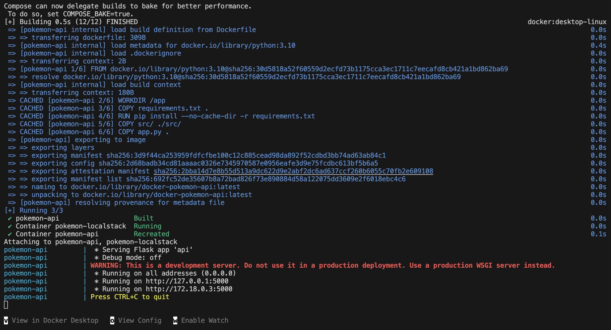
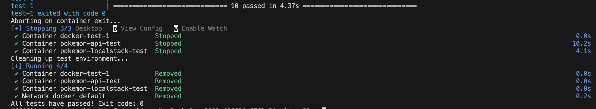

# CS6620-CICD-Pipeline-p3
This is a HW assignment for CS6620 (Cloud Computing) at the Roux Institute at Northeastern. It is a simple Pokemon-themed cloud RestAPI (with GET, PUT, POST, and DELETE endpoints) built on top of the original Pokemon class from the Part 2 assignment found [here](https://github.com/charVANder/CS6620-CICD-Pipeline-p2) (Part 1 can be found [here](https://github.com/charVANder/CS6620-CICD-Pipeline-p1)). Demonstrates test-driven development, Docker container orchestration, CRUD operations, and CI/CD workflows. For the sake of addressing the current assignment with simplicity, the previous battle mechanics were removed, focusing on turning the API into a viable cloud architecture implementation. CRUD operations were added to function in a DynamoDB table and an S3 bucket. Localstack was used to run a mock of AWS as part of the application stack. Two docker compose files with corresponding shell scripts were created to run the stack (until manually stopped) and run the tests.

A GitHub Actions workflow runs tests automatically whenever code is pushed, a pull request is opened, or the workflow is triggered manually. Test workflow can be triggered manually by going to the Actions tab and clicking on the Run Workflow button under the Pokemon Tests workflow. You can view the configuration in `.github/workflows/main.yml`.

## Running the Stack
Assuming that you have Docker running, here is how to run the stack until manually stopped:
```bash
chmod +x scripts/run_stack.sh
./scripts/run_stack.sh
# press Ctrl+C to stop manually
```

LocalStack is found at http://localhost:4566, although it will just be an empty page.

If you go to http://localhost:5001/health, then you should see something like:
```
{"Note":"The Pokemon API is running","Status":"healthy"}
```

Similarly, if you go to http://localhost:5001/pokemon, then you should see something like:
```
{"count":0,"pokemon":[]}
```

Shown below is an image of the stack being built successfully:
<p float="left", align="center">
  
</p>

## Running the Tests
Here is how you run the tests:
```bash
chmod +x scripts/run_tests.sh
./scripts/run_tests.sh
```
It should exits with 0 if tests pass, and non-zero (1) if tests fail. Shown below is an image of this working successfully:
<p float="left", align="center">
  
</p>


## References and AI Appendix
* LocalStack with Docker Compose - https://medium.com/@muthomititus/a-guide-to-localstack-with-docker-compose-e1487e3a776f
* Error handling with boto3 - https://boto3.amazonaws.com/v1/documentation/api/latest/guide/error-handling.html
* DynamoDB boto3 client functions - https://boto3.amazonaws.com/v1/documentation/api/latest/reference/services/dynamodb.html
* S3 boto3 client functions - https://boto3.amazonaws.com/v1/documentation/api/latest/reference/services/dynamodb.html
* Conftest and pytest fixtures - https://docs.pytest.org/en/6.2.x/fixture.html
* LocalStack docs - https://docs.localstack.cloud/aws/getting-started/installation/
  
  ---

  ### MY TODO/CHECKLIST
* ~~Remove the battle mechanics endpoints stuff from api.py (only simple GET/POST/PUT/DELETE will be needed)~~
* ~~Remove the old Dockerfiles (I'll probably just make a single simple Dockerfile to go with the compose files)~~
* ~~Change the requirements.txt and environment.yml to have boto3~~
* ~~Make a simple Dockerfile~~
* ~~Make an aws.py for the new aws integration stuff (like initiating the DynamoDB operations and s3 bucket stuff). I'll probably have create_pokemon, get_pokemon, get_all_pokemon, update_pokemon, and delete_pokemon all in the DB and S3.~~
* ~~Create the docker-compose files (one for the stack and one for the tests).~~
* ~~Fix pokemon.py so that it works with dynamoDB. NOTE: I actually didn't need this, but didn't realize until later TT_TT~~
* ~~Fix api.py so that it works with all the AWS stuff and doesn't use all the battle mechanic endpoints.~~
* ~~Replace run_api.sh with run_stack.sh to work with docker-compose.yml. Similarly, update the run_tests.sh so that it works with the test docker-compose file.~~
* ~~Remove test_pokemon.py and create a new file for testing configurations (need to look into if I'll need this)~~
  * ~~It would be helpful to have something cleanup the pokemon after tests. Also a sample pokemon.~~
* ~~Fix test_api.py so that it covers the required tests. Requirements were...~~
  * ~~GET with appropriate params (testing get pokemon with id)~~
  * ~~GET that finds no results (testing get pokemon not found)~~
  * ~~GET with no params (testing get all pokemon)~~
  * ~~GET with incorrect params (so like an invalid id)~~
  * ~~POST stores in DB and S3~~
  * ~~Handling duplicate POST (posting duplicate pokemon)~~
  * ~~PUT updates existing resource (pokemon needs to show up in db and s3)~~
  * ~~PUT with no valid target (put a non-existing pokemon)~~
  * ~~DELETE removes from db and S3 (delete a pokemon and check)~~
  * ~~DELETE with no valid target (delete a nonexistent pokemon)~~
* ~~Update the Github workflows~~
* ~~Debug like crazy~~
* ~~Update the README~~
* ~~Celebrate (yay!), make some tea, and play Zelda (or work on my final project... 0_o)~~